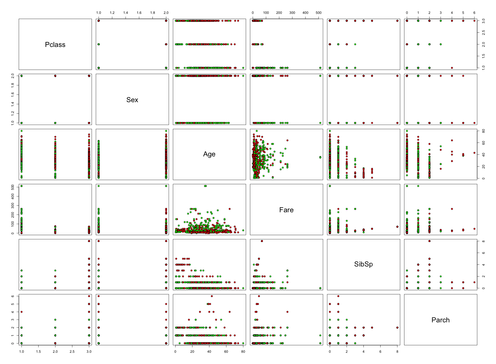

##Analysis

###Initial Observations
- There is a direct correlation between the passenger class and the survival rate, with a higher percentage of first class passengers suriving than that of third class.
- Females and children had a higher survival rate than men and the elderly
- Children had a higher survival rate if they had a parent aboard.
- Parents had a lower survival rate if they had children with them.